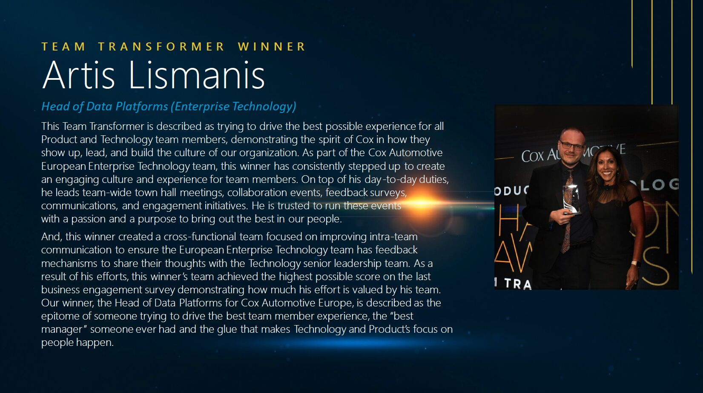

I was really chuffed and humbled to receive Team Transformer award at inaugural Cox Automotive Inc. Product & Technology Champion Awards a couple of weeks ago. Didn't expect to be nominated, even less to win an award. And what an event it was! #lifeatcox

<!--more-->

[LinkedIn - Cox Automotive Inc. Product & Technology Champion Awards](https://www.linkedin.com/posts/cox-automotive-inc-_product-technology-champion-awards-highlights-ugcPost-7044700957544218624-P6DA)

The Cox Automotive Product and Enterprise Technology teams introduced an award program called The Product & Technology Champion Awards. This program recognizes the exceptional talent and contributions that our employees make towards driving higher outcomes and impacts to our business, customers, each other, and the communities we serve. The first award ceremony took place on 16th March 2023 – check out this awesome highlight reel from the incredible event.


&NewLine;

[LinkedIn - Team Transformer Award Details](https://www.linkedin.com/posts/cox-automotive-inc-_coxautomotive-activity-7047309599783145472-WPEA)

As a part of The Product & Technology Champion Awards, the Team Transformer Award winners are the game changers working to deliver the greatest internal team member experience, or the greatest impact on internal efficiency. They are constantly scanning their space to identify team pain points and opportunities to continuously improve and optimize team processes, capabilities, and performance.

