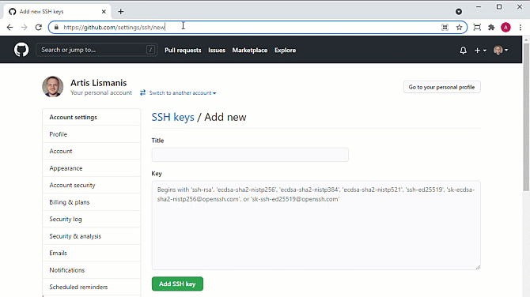
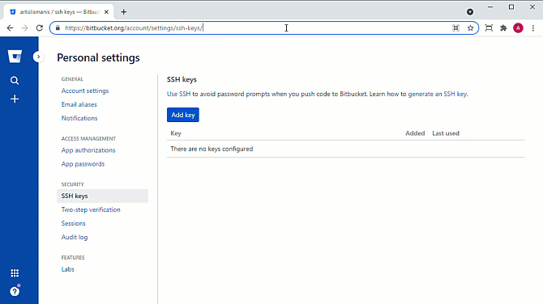
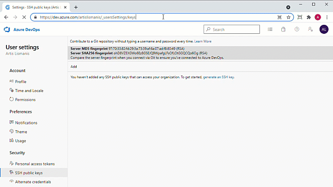
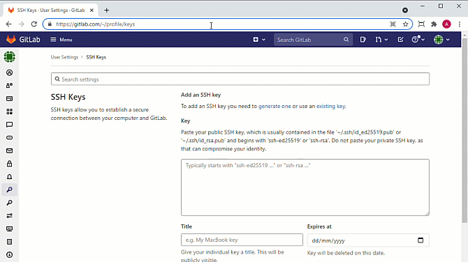
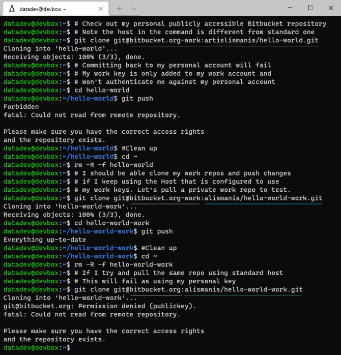

On those rare occasions when I get a chance to code I tend to work on Ubuntu based virtual environments - VirtualBox VMs and more recently WSL. It is also pretty much a given that I'd need to interact with different Git hosting services like GutHub and BitBucket, and it usually takes quite a bit of tinkering to get everything set up and working smoothly with all the various accounts. These are my steps to to get the Git and GitFlow installed and configured in a jiffy. :rocket:

<!--more-->

This how-to assumes you have a Debian-based Linux distribution installed and ready to go and that you are logged in as a non-root user with sudo permissions.

## For the impatient {#impatient}

Review [the gist](https://gist.github.com/artislismanis/077827377606291f6c6bb200f9e8a02e) that contains all the different commands described in this post packaged up as a shell script. Download it, run it, get coding!

```bash
# Install curl, if not already installed
sudo apt-get update && sudo apt-get -y install curl

# Download gist as raw file, pass it into bash run it
bash <(curl -sL https://gist.githubusercontent.com/artislismanis/077827377606291f6c6bb200f9e8a02e/raw/cfcada5875b938b41a4059224593217dffd4f36d/setup_git_gitflow.sh)
```

Once done, skip to the [Adding SSH keys to Git hosting services]() section on how to add your SSH keys to the Git hosting services accounts.  

## Install Git & GitFlow

It is literally a one-liner to install Git and GitFlow extension. GitFlow is optional and only useful if you work with GitFlow branching model. I really like [BitBucket's git workflow explanations and comparisons](https://www.atlassian.com/git/tutorials/comparing-workflows) if you want to dive into more detail around available approaches.

```bash
# Update package list. Install git and git-flow. 
sudo apt-get update && sudo apt-get install git git-flow
```

It is also a good idea to set some useful global Git configuration defaults like your user details and how you want your default git branch to be named.  

```bash
# Set some Git configuration defaults
git config --global user.name "John Doe"
git config --global user.email "john.doe@example.com"
git config --global init.defaultBranch main
```

This is all you really need to start using Git locally.

I also like to tweak some GitFlow defaults to my preference so that new repositories can be initialised quicker and more consistently. This sets `main` branch for releases and prefixes to use a dash as a separator instead of forward slash (I promise there is a method in this madness).  

```bash
# Tweak GitFlow configuration defaults
# Set release branch
git config --global gitflow.branch.master main
# Set development branch
git config --global gitflow.branch.develop develop
# Set prefixes for other types of branches
git config --global gitflow.prefix.feature feature-
git config --global gitflow.prefix.bugfix bugfix-
git config --global gitflow.prefix.release release-
git config --global gitflow.prefix.hotfix hotfix-
git config --global gitflow.prefix.support support-
git config --global gitflow.prefix.versiontag "" 
```

Developing locally is great, but what's the fun in writing code and not sharing it with others? Let's get sharing!

## Working with Git hosting services

I find that using SSH to work with Git hosting providers provides a better experience than using HTTPS. Using SSH keys is generally a more secure way to exchange your credentials and removes the need to authenticate for each git action performed. OK, OK, I know there are ways to work around this, but somehow SSH approach feels more robust, more standard. :stuck_out_tongue: I tend to generate a new SSH key per virtual environment and re-use this across different services, but you can be uber-secure and tweak instructions below to generate separate keys for each environment and service combination.

### Generating SSH keys

First we generate a new key pair: a public and a private key. Enter and confirm a passphrase when prompted. Leaving passphrase empty will create a key pair without a passphrase. You will keep the private key on your system and upload the public key to your Git hosting provider's account.

```bash
# Generate a new SSH key. -t switch sets the key type, -b bits, 
# -f destination file, -C comment. 
ssh-keygen -t rsa -b 4096 -f ~/.ssh/vcs.key -C "john.doe@example.com"

# If you want to live on the edge and create a key without a passphrase,
# you can add -N "" switch which specifies passphrase as empty string.
# This will generate a new SSH key without any prompts.
#ssh-keygen -t rsa -b 4096 -f ~/.ssh/vcs.key -N "" -C "john.doe@example.com"

# GitHub and Bitbucket can use more modern key types
#ssh-keygen -t ed25519 -f ~/.ssh/vcs.key -C "john.doe@example.com"
```

Note I'm using RSA key instead of more modern types to ensure compatibility with Azure DevOps. If you don't require this, you can safely change `-t rsa` in the example above to `-t ed25519` and remove `-b 4096` switch.

### Customising SSH Configuration

As a next step you will want to create a configuration file that specifies which keys are to be used for various services. You can copy and paste the code below on your command line to update your SSH config file to include settings for the more popular Git hosting providers.

The configuration file is a bit repetitive and could be easily be compressed into a single configuration block, however, kept as is, it can be easily modified to specify a separate key per provider or even extended to support multiple accounts with the same provider.

```bash
# Append BitBucket, GitHub, Azure DevOps and GitLab settings to SSH config
# Creates new config file if it doesn't already exist
cat << EOF >> ~/.ssh/config

Host github.com
  Hostname github.com
  User git
  IdentityFile ~/.ssh/vcs.key
  IdentitiesOnly yes

Host bitbucket.org
  Hostname bitbucket.org
  User git
  IdentityFile ~/.ssh/vcs.key
  IdentitiesOnly yes

#Host bitbucket.org-work
#  Hostname bitbucket.org
#  User git
#  IdentityFile ~/.ssh/vcs_work.key
#  IdentitiesOnly yes

Host ssh.dev.azure.com
  Hostname ssh.dev.azure.com
  User git
  IdentityFile ~/.ssh/vcs.key
  IdentitiesOnly yes

Host gitlab.com
  Hostname gitlab.com
  User git
  IdentityFile ~/.ssh/vcs.key
  IdentitiesOnly yes

EOF
```

SSH requires for all files in `.ssh` folder to be properly secured. To keep it simple I tend to apply a blanket rule of only allowing the owner account to have read/write access to the files.

```bash
# Set all files in .ssh folder to only be accessible by the owner
chmod 600 ~/.ssh/*
```

### Adding SSH keys to Git hosting services {#add-keys}

Now that your SSH keys and configuration have been set up you can add your public key or keys to your Git hosting accounts. The general pattern is to get details of your public key, head to your account and add the key. See below for some  quick start instructions.

Start by printing out details of your public key and copy these to clipboard.

```bash
#Output public key so this can be copied for adding to your account. 
cat ~/.ssh/vcs.key.pub
```

For GitHub, head to [https://github.com/settings/ssh/new](https://github.com/settings/ssh/new), log in if necessary. Give your key a descriptive title. Paste the key value. Click **Add SSH key**. You might be asked to re-enter your password.



For Bitbucket, head to [https://bitbucket.org/account/settings/ssh-keys/](https://bitbucket.org/account/settings/ssh-keys/), log in if necessary. Click **Add key**. Give your key a descriptive title. Paste the key value. Click **Add key**.



For Azure DevOps, head to [https://dev.azure.com/YOUR_ORG/_usersSettings/keys?action=edit](https://dev.azure.com/YOUR_ORG/_usersSettings/keys?action=edit) (replace YOUR_ORG in the link with the name of your Azure DevOps organisation), log in if necessary. Click **Add**. Give your key a descriptive title. Paste the key value.  Click **Save**.



For GitLab SaaS, head to [https://gitlab.com/-/profile/keys](https://gitlab.com/-/profile/keys), log in if necessary. Paste the key value. Give your key a descriptive title. Optionally set expiry date. Click **Add key**.



All major players provide detailed instructions on how to do this if you get stuck: [GitHub](https://docs.github.com/en/github/authenticating-to-github/connecting-to-github-with-ssh/adding-a-new-ssh-key-to-your-github-account), [Bitbucket](https://support.atlassian.com/bitbucket-cloud/docs/set-up-an-ssh-key/), [Azure DevOps](https://docs.microsoft.com/en-us/azure/devops/repos/git/use-ssh-keys-to-authenticate?view=azure-devops) and [GitLab](https://docs.gitlab.com/ee/ssh/index.html#generate-an-ssh-key-pair).

### How do I know if it worked?

Find a repository to clone on your provider's service and use SSH based access details. If the key has not been set up correctly even a simple operation like cloning of a public repository will fail.

```bash
# Basic repos to test different providers
# Remove repo between testing multiple providers and once done
# rm -R -f hello-world/
# Test GitHub
git clone git@github.com:artislismanis/hello-world.git
# Test Bitbucket
git clone git@bitbucket.org:artislismanis/hello-world.git
# Test Azure DevOps
git clone git@ssh.dev.azure.com:v3/artislismanis/hello-world/hello-world
# Test GitLab
git clone git@gitlab.com:artislismanis-projects/hello-world.git
```

Done! There are a couple of optional steps below that you might want to check out but you should now be ready to work with various Git hosting providers.

### Managing multiple accounts per service (optional)

One interesting use case is when you are working with multiple individual accounts on the same provider, for example, using one set of credentials for your personal projects and another one for work. SSH `config` file to the rescue!

The configuration file we created previously had a second, commented out, section for Bitbucket. If you inspect this, you will notice that it is almost identical to the first Bitbucket entry with the only differences being `Host` identifier and `IdentityFile` setting.

The way it works is that SSH monitors and intercepts Git commands involving SSH protocol. It looks for the configured `Host` values in the connection string and then applies configuration settings matched. The `Host` value is internal to SSH, can be pretty much anything as long as underlying config contains valid hostname, user and identity details. In this specific scenario I have added `-work` suffix to standard `bitbucket.org` hostname and specified a separate key file to be used when this configuration gets triggered.

How does this work in practice? If I uncomment the second block of Bitbucket config, save the configuration file, generate a separate key pair called `vcs-work.key` for my work account and add the public part of that key to my work Bitbucket account, I can connect to different Bitbucket repositories using different sets of credentials as demonstrated below.



Before you start using your work repos in earnest remember to override the default user name and email that we set globally on repo by repo basis as appropriate. To do this you can run commands below while inside the checked out repository folder.

```bash
git config user.name "John F. Doe"
git config user.email "john.f.doe@example-work.com"
```

### Setting up ssh-agent (optional)

If you specified a passphrase for your SSH key, and you should have, you wil be asked to enter this every time the key is used. This can get quite annoying quite quickly and slow down your workflow. One solution is to use a tool called `ssh-agent` to cache your passphrase for the duration of your shell session so that this can be transparently used for multiple calls and across multiple services. You can run the commands below every time you intend to work with VCS hosting providers you have set up in the previous steps.

```bash
# Start ssh-agent if not already running
eval "$(ssh-agent -s)"
# Add the newly generated key
ssh-add ~/.ssh/vcs.key
```

If you want to save a few keyboard strokes, the alternative is to tweak your profile settings to start `ssh-agent` and load relevant keys every time you log into your environment. The code below is taken from [GitHub Docs](https://docs.github.com/en/github/authenticating-to-github/connecting-to-github-with-ssh/working-with-ssh-key-passphrases#auto-launching-ssh-agent-on-git-for-windows), just slightly tweaked to load any keys in `.ssh` folder that start with `vcs` and end in `.key`. Further tweaks include explicitly killing `ssh-agent` process on exiting the shell and loading keys whenever we attempt to start `ssh-agent` (even if it is already running with keys loaded). Running the code snippet below will add the configuration setting to your `.profile` file if it already exists or create it for you if not.

```bash
cat << 'EOF' >> ~/.profile

# Read all keys in .ssh folder that start with 'vcs' and end in '.key'.
# Change to suit your requirements
keys=~/.ssh/vcs*.key
env=~/.ssh/agent.env

agent_load_env () { test -f "$env" && . "$env" >| /dev/null ; }

agent_start () {
    (umask 077; ssh-agent >| "$env")
    . "$env" >| /dev/null ; trap "kill $SSH_AGENT_PID" 0 }

agent_load_env

# agent_run_state: 0=agent running w/ key; 1=agent w/o key; 2=agent not running
agent_run_state=$(ssh-add -l >| /dev/null 2>&1; echo $?)

if [ ! "$SSH_AUTH_SOCK" ] || [ $agent_run_state = 2 ]; then
    agent_start
    ssh-add $keys
elif [ "$SSH_AUTH_SOCK" ] && [ ! $agent_run_state = 2 ]; then
    ssh-add $keys
fi

unset env

EOF
```

## What's next?

Now that you got this far :thumbsup: it is probably time to head back to [For the impatient]( "About Us") section and look at how most of the steps described can be automated and applied within matter of seconds.
